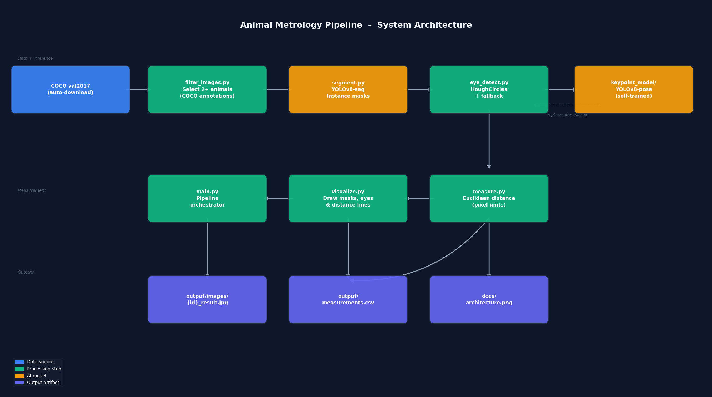

# Animal Metrology Pipeline

使用 YOLOv8-seg 對 COCO 資料集進行動物分割，並量測雙眼距離與跨動物右眼距離。

## 技術棧

| 工具 | 用途 |
|------|------|
| YOLOv8-seg (ultralytics) | Instance segmentation |
| OpenCV HoughCircles | 眼睛偵測 |
| pandas | CSV 輸出 |
| PyTorch + CUDA | GPU 加速推論 |

## 本地運行

```bash
# 1. 安裝依賴
pip install -r requirements.txt

# 2. 複製環境設定
cp .env.example .env

# 3. 執行 pipeline（自動下載 COCO ~1.2GB）
python src/main.py
```

結果輸出至 `output/images/` 和 `output/measurements.csv`。

## Docker 部署

```bash
docker-compose up --build
```

## 系統架構



## 量測公式

**單隻動物雙眼距離：**
```
d = sqrt((x_right - x_left)² + (y_right - y_left)²)
```

**兩隻動物右眼距離：**
```
d = sqrt((x_A_right - x_B_right)² + (y_A_right - y_B_right)²)
```

所有量測單位為 **像素（pixel）**。

## AI 模型說明

使用 `yolov8n-seg.pt`（YOLOv8 nano segmentation）：
- 預訓練於 COCO80，直接支援 10 種動物類別
- Box mAP@50: 52.0 / Mask mAP@50: 42.4（官方 COCO val2017）
- 評估指標：IoU = (Mask_pred ∩ Mask_gt) / (Mask_pred ∪ Mask_gt)

## 測試帳號

本系統不含使用者認證，無需測試帳號。

## 測試

```bash
pytest tests/ -v
```
